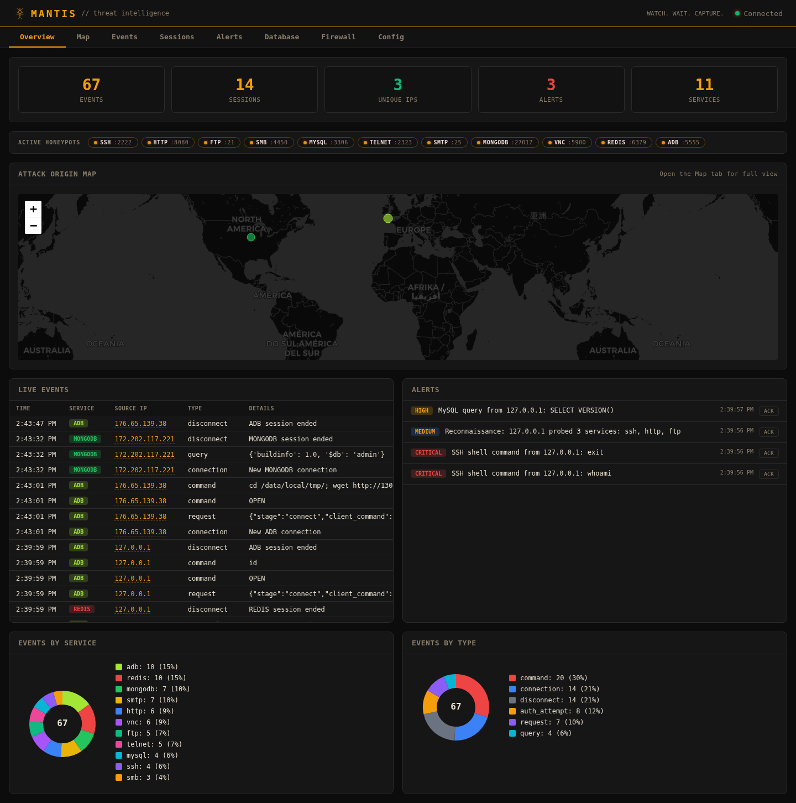
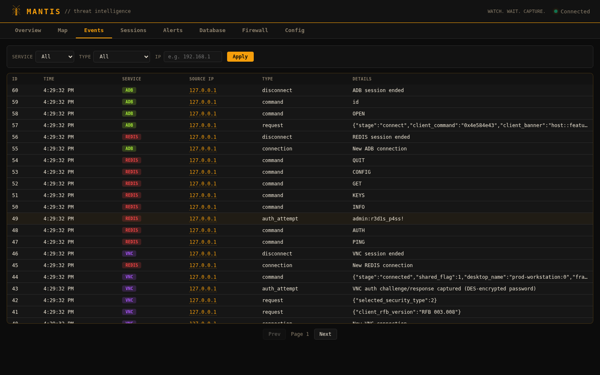
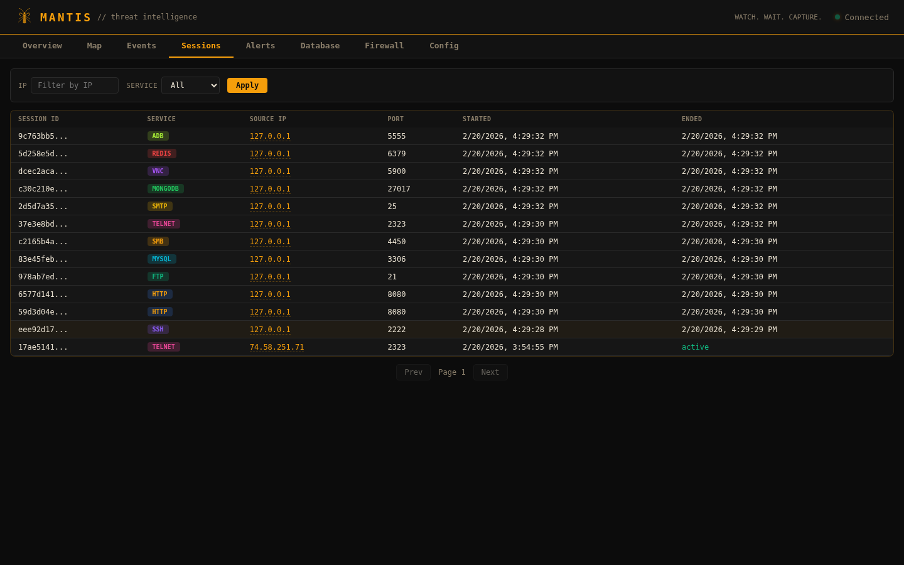
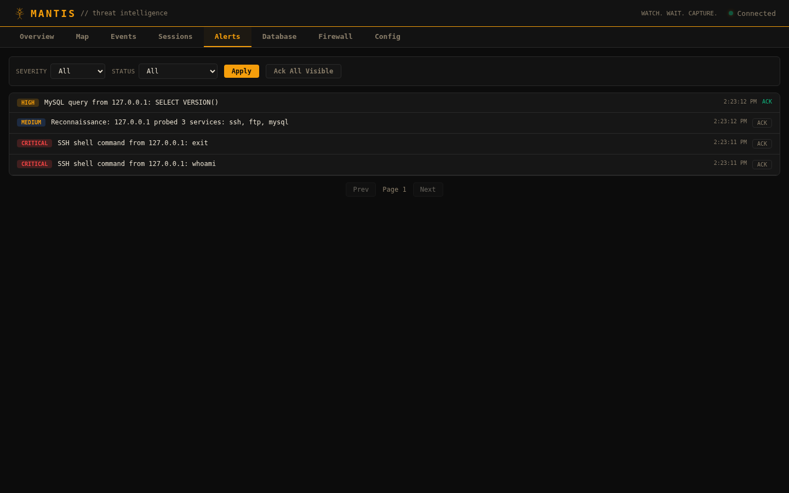
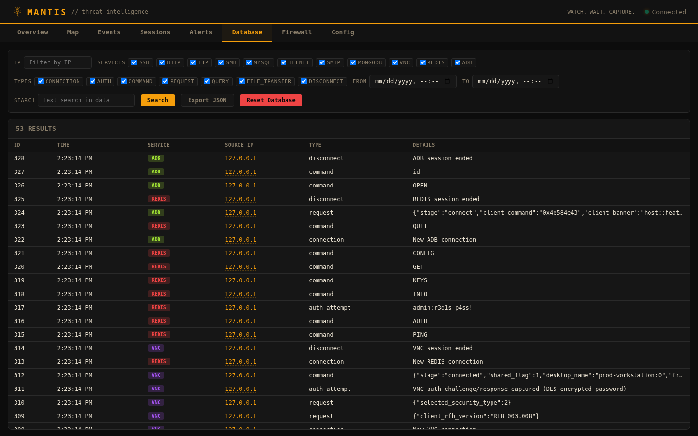
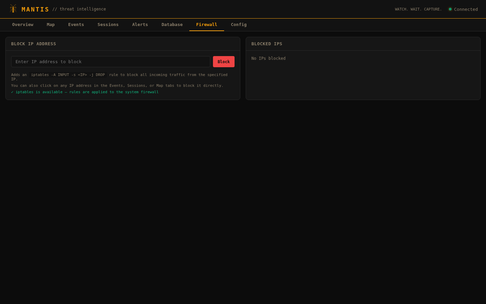
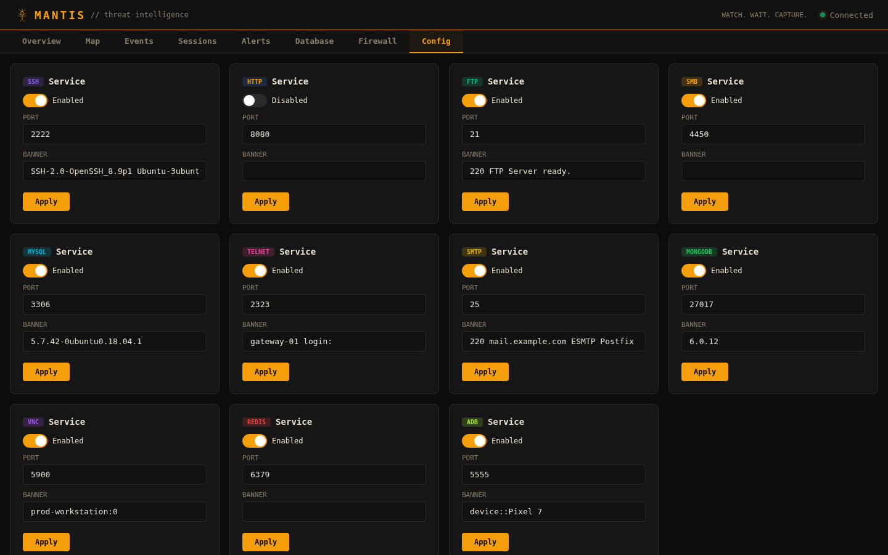

# MANTIS - HoneyPot Deployment Kit


**MANTIS** is a multi-protocol network honeypot and threat intelligence platform. It deploys 11 realistic decoy services that mimic production systems, captures attacker credentials, commands, and payloads in real time, and presents everything through a live web dashboard with geolocation mapping and alerting.

Built entirely in Python with asyncio for high concurrency and zero threads per connection.



---

## Features

- **11 honeypot services** with wire-protocol-level fidelity
- **Real-time dashboard** with WebSocket live feed, filterable event log, session tracking, and alert management
- **Attack origin map** with IP geolocation (ip-api.com)
- **IP blocking / firewall** — click any IP in the dashboard to block it via iptables, manage blocked IPs from the Firewall tab
- **Automated alerts** — reconnaissance detection, credential harvesting, SQL injection, shell commands
- **Profile system** — switch between minimal, database-trap, and full deployments with YAML configs
- **SQLite storage** with full-text search, JSON export, and database management
- **Zero external dependencies** for service emulation (pure Python protocol implementations)

---
## Supported Services

| Service | Default Port | Protocol Detail |
|---------|-------------|-----------------|
| **SSH** | 2222 | Full Paramiko-based SSH server with shell emulation, command logging, and credential capture |
| **HTTP** | 8080 | Login page honeypot — captures GET/POST requests, form credentials, and user agents |
| **FTP** | 21 | RFC 959 implementation with USER/PASS capture, fake directory listings, and file transfer logging |
| **SMB** | 4450 | SMB1/SMB2 negotiate + NTLM authentication capture with session setup |
| **MySQL** | 3306 | Full handshake (v10 protocol), authentication, and COM_QUERY logging |
| **Telnet** | 23 | Interactive shell with login prompt, command history, and fake filesystem responses |
| **SMTP** | 25 | RFC 5321 with EHLO, AUTH LOGIN/PLAIN (base64 credential decode), MAIL FROM/RCPT TO/DATA capture |
| **MongoDB** | 27017 | OP_QUERY + OP_MSG wire protocol, custom BSON codec, isMaster/saslStart auth, listDatabases |
| **VNC** | 5900 | RFB 3.8 handshake, VNC Auth (DES challenge/response capture), ServerInit with fake framebuffer |
| **Redis** | 6379 | RESP protocol parser, AUTH capture, INFO/KEYS/GET with fake sensitive data, threat detection for CONFIG SET/SLAVEOF/MODULE LOAD |
| **ADB** | 5555 | Android Debug Bridge binary protocol (CNXN/OPEN/WRTE/CLSE), fake Pixel 7 device, shell command responses |

---

## Screenshots


### Events — Filterable event log with clickable IPs across all 11 services



### Sessions — All connections across 11 services with color-coded badges



### Alerts — Severity-based threat alerts (Critical / High / Medium) with acknowledgment



### Database — Advanced search with service/type filters, date range, and JSON export



### Firewall — Block/unblock attacker IPs via iptables directly from the dashboard



### Config — Enable/disable services and configure ports and banners live



---

## Quick Start

### Requirements

- Python 3.10+
- pip

### Install

```bash
git clone https://github.com/Syn2Much/MANTIS.git && cd MANTIS
pip install -r requirements.txt
```

### Run (Interactive)

```bash
python main.py
```

This launches an interactive setup where you:

1. **Select services** — checkbox list of all 11 honeypots (spacebar to toggle, Enter to confirm)
2. **Configure ports** — optionally set custom ports for each selected service and the dashboard
3. **Set auth token** — accept the auto-generated token or type your own

The dashboard starts at **<http://localhost:8843>** by default.

### Run (Headless)

For scripts, systemd, Docker, or CI — skip all prompts:

```bash
# All defaults, no prompts
python main.py --headless

# Load from YAML config, no prompts
python main.py --headless --config profiles/default.yaml
```

### Dashboard Authentication

An auth token is always set — either auto-generated or entered during interactive setup. All dashboard routes require authentication. The login page will prompt for the token. API requests can authenticate via:

- **Cookie** — set automatically after login
- **Bearer token** — `Authorization: Bearer YOUR_SECRET_TOKEN`
- **WebSocket** — token passed as query parameter

### CLI Options

```
python main.py [options]

Options:
  --headless               Non-interactive mode (all defaults)
  -c, --config FILE        YAML config file path
  --db PATH                Database file path
  -v, --verbose            Debug logging
  -q, --quiet              Errors only
```

### Statistics

```bash
python main.py stats
python main.py stats --db /path/to/honeypot.db
```

---

## Profiles

Profiles are YAML files that control which services are enabled and on which ports.

**`default.yaml`** — All 11 services enabled with standard banners:

```yaml
ssh:
  enabled: true
  port: 2222
  banner: "SSH-2.0-OpenSSH_8.9p1 Ubuntu-3ubuntu0.6"
http:
  enabled: true
  port: 8080
mysql:
  enabled: true
  port: 3306
  banner: "5.7.42-0ubuntu0.18.04.1"
# ... all 11 services
```

**`minimal.yaml`** — SSH + HTTP only (lightweight):

```yaml
ssh:
  enabled: true
  port: 2222
http:
  enabled: true
  port: 8080
# all other services: enabled: false
```

**`database_trap.yaml`** — Databases + file services:

```yaml
mysql:
  enabled: true
  port: 3306
mongodb:
  enabled: true
  port: 27017
redis:
  enabled: true
  port: 6379
ftp:
  enabled: true
  port: 2121
smb:
  enabled: true
  port: 4450
```

---

## Dashboard API

The dashboard exposes a REST API on the same port:

| Endpoint | Method | Description |
|----------|--------|-------------|
| `/api/stats` | GET | Aggregate statistics (events, sessions, IPs, alerts) |
| `/api/events` | GET | Event log with filters (`service`, `type`, `ip`, `limit`) |
| `/api/sessions` | GET | Session list with filters (`service`, `ip`, `limit`) |
| `/api/alerts` | GET | Alerts with severity/status filters |
| `/api/alerts/<id>/ack` | POST | Acknowledge an alert |
| `/api/geo/<ip>` | GET | GeoIP lookup |
| `/api/map` | GET | Map data with coordinates |
| `/api/config` | GET | Current service configuration |
| `/api/ips` | GET | Unique source IPs |
| `/api/firewall/blocked` | GET | List currently blocked IPs |
| `/api/firewall/block` | POST | Block an IP via iptables (`{"ip": "x.x.x.x"}`) |
| `/api/firewall/unblock` | POST | Unblock an IP (`{"ip": "x.x.x.x"}`) |
| `/api/database/reset` | POST | Reset the database |
| `/ws` | WebSocket | Real-time event stream |

---

## Testing

The included endpoint tester generates traffic across all 11 services and validates every dashboard API endpoint:

```bash
python test_endpoints.py
```

```
MANTIS Endpoint Tester
Target: 127.0.0.1

============================================================
  Honeypot Service Probes
============================================================
  [PASS] SSH        banner: SSH-2.0-OpenSSH_8.9p1 Ubuntu-3ubuntu0.6
  [PASS] HTTP GET / status=200, body=2936b
  [PASS] HTTP POST  status=302
  [PASS] FTP        banner: 220 FTP Server ready.
  [PASS] MySQL      handshake=95b, auth_resp=11b, query_resp=55b
  [PASS] SMB        negotiate response=133b
  [PASS] Telnet     banner received
  [PASS] SMTP       banner: 220 mail.example.com ESMTP Postfix (Ubuntu)
  [PASS] SMTP AUTH  auth: 235 2.7.0 Authentication successful
  [PASS] MongoDB    isMaster resp=186b, listDatabases resp=315b
  [PASS] VNC        version: RFB 003.008, auth_ok=True
  [PASS] Redis      ping: +PONG, auth: +OK
  [PASS] ADB        device: Pixel 7
  [PASS] ADB shell  uid=0(root) gid=0(root)
  ...
  31 passed, 0 failed out of 31 checks
```

---

## Architecture

```
main.py                  # Entry point
honeypot/
├── __init__.py          # Package metadata
├── __main__.py          # Module entry point
├── cli.py               # Interactive CLI (questionary), headless mode, banner
├── config.py            # YAML config loading, ServiceConfig dataclass
├── core.py              # HoneypotOrchestrator — starts all services
├── database.py          # Async SQLite with pub/sub for WebSocket
├── models.py            # EventType enum, ServiceType enum
├── alerts.py            # Alert engine (severity rules, webhook support)
├── dashboard/
│   ├── server.py        # aiohttp web server + REST API + WebSocket
│   └── templates.py     # Single-file HTML/CSS/JS dashboard
├── services/
│   ├── __init__.py      # BaseHoneypotService ABC
│   ├── ssh.py           # SSH (Paramiko)
│   ├── http.py          # HTTP login trap
│   ├── ftp.py           # FTP
│   ├── smb.py           # SMB/CIFS
│   ├── mysql.py         # MySQL
│   ├── telnet.py        # Telnet
│   ├── smtp.py          # SMTP
│   ├── mongodb.py       # MongoDB (custom BSON codec)
│   ├── vnc.py           # VNC/RFB
│   ├── redis.py         # Redis (RESP protocol)
│   └── adb.py           # Android Debug Bridge
profiles/
├── default.yaml         # All services
├── minimal.yaml         # SSH + HTTP
└── database_trap.yaml   # Database services
```

Each service extends `BaseHoneypotService` and implements:

- `async start()` — bind to port and begin accepting connections
- `async _handle_client()` — protocol-specific interaction loop
- `_create_session()` / `_log()` / `_end_session()` — event pipeline to SQLite + WebSocket

---

## License

MIT
